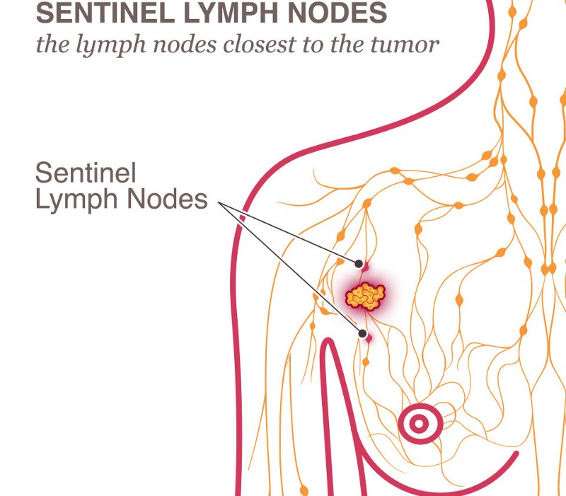
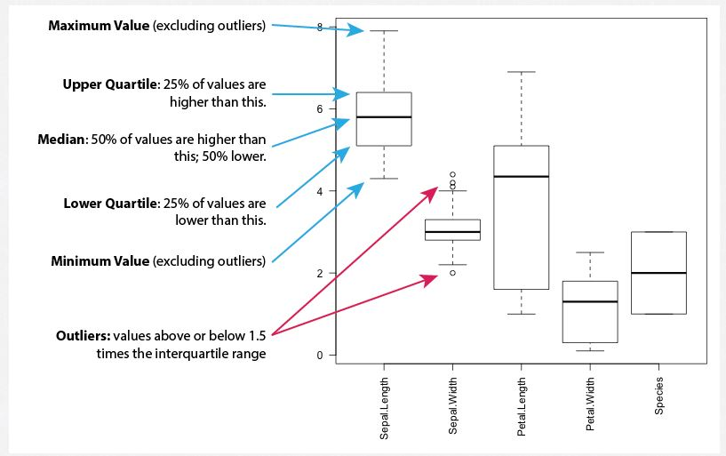
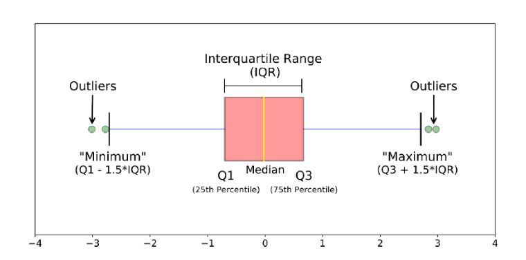

# Exploratory Data Analysis on Haberman’s Survival Data Set

### About - 
 Haberman’s data set contains data from the study conducted in University of Chicago’s Billings Hospital between year 1958 to 1970 for the patients who undergone surgery of breast cancer.
Source  - https://www.kaggle.com/gilsousa/habermans-survival-data-set

## Aim - 
**To predict the possibility of a breast cancer patient survival after surgery for it.** 

### Attributes -

There are 4 attribute in this data set out of which 3 are features and 1 class attribute as below. Also, there are 306 instances of data.

* Age of patient at time of operation. (varies from 30-83, numerical)
* Patient's year of operation (1958-1969, numerical)
* Number of positive axillary nodes detected (numerical)
* Survival status: 
    - 1 = the patient survived 5 years or longer.
    - 2 = the patient died within 5 year.

### Research questions - 
1. Does Age have an affect on survival status?
2. Does the year of operations have an affect on survival status?
3. Does number of detected auxiliary nodes have an affect?

#### Lymph Node - 
Lymph nodes are small, bean-shaped organs that act as filters along the lymph fluid channels. As lymph fluid leaves the breast and eventually goes back into the bloodstream, the lymph nodes try to catch and trap cancer cells before they reach other parts of the body.  
*Having cancer cells in the lymph nodes under your arm suggests an increased risk of the cancer spreading. In our data it is axillary nodes detected(0–52)*

### Packages used - 
*Multiple packages were used* in the notenook. These packages were imported into python 3 version. The packages are:
* Numpy
* Pandas
* Seaborn
* Matplotlib

The first two packages are for combutation and data analysis, and the other two package are for data visulaization. However, Machine learning is covered in other notebook.

## Data Visualization
We now have a basic idea about the data. We need to extend that with some visualizations.
We are going to look at two types of plots:

- ***Univariate plots*** to better understand each attribute, without dealing with causes or relationship.
    * 1-D scatter plot
        - In this plot, we are taking either x or y coordinate of a feature of plotting point and making the other coordinate as zero
    * Histogram
        - Distribution plots(Histogram) are used to visually assess how the data points are distributed with respect to its frequency.
        - Usually the data points are grouped into bins and the height of the bars representing each group increases with increase in the number of data points lie within that group. (histogram).
        - Probability Density Function (PDF) is the probability that the variable takes a value x. (smoothed version of the histogram).
        - Kernel Density Estimate (KDE) is the way to estimate the PDF. The area under the KDE curve is 1.  
            *Here the height of the bar denotes the percentage of data points under the corresponding group*
   
    *  Probability Density Function(PDF) and Cumulative Distribution Function (CDF)
        - Probability Densitiy Function (**PDF**) - It shows the probability of a data point lie under the curve.  
        - Cumulative Distribution Function(**CDF**) - The percent of the data points lies under a limit.
    * Box plot
        - A boxplot is a standardized way of displaying the distribution of data based on a five number summary (“minimum”, first quartile (Q1), median, third quartile (Q3), and “maximum”). It can tell you about your outliers and what their values are. It can also tell you if your data is symmetrical, how tightly your data is grouped, and if and how your data is skewed.

    * Violin plot
        * The violin plot is used to visualise the distribution of the data and its probability density. The thick black bar in the center represents the interquartile range, the thin black line extended from it represents the 95% confidence intervals, and the white dot is the median.

    * Swarm plot
        * A swarm plot can be drawn on its own, but it is also a good complement to a box or violin plot in cases where you want to show all observations along with some representation of the underlying distribution.
 
     
- ***Multivariate plots*** to better understand the relationships between attributes.
    * Scatter plot
        * A scatter plot is a two-dimensional data visualization that uses dots to represent the values obtained for two different variables - one plotted along the x-axis and the other plotted along the y-axis.
    * Pair plot
        * Pair plot is used to understand the best set of features to explain a relationship between two variables or to form the most separated clusters.
        * It reduces higher dimensions(variables) into a matrix of 2D plots.
        * However, pair plot are fairly to be understand if the variable are less(4c2 = 6). If the variable are more than 6(6c2 = 15), deriving insights Pair plots will become a complex part
    

### Observations -

##### Age factor - 
* Most of the patients who had undergone surgery were aged between 42-60 years.
* All the patients aged less than 34 years at the time of surgery survived regardless of the number of axillary nodes.
* None of the patients aged older than 76-77 years survived. 
* Early age i.e. 40-50 age group's operation gave better results in surviving more people for more than 5 years and later age groups i.e. 50-55 age band survived less than 5 years.

##### Year of operations as factor - 
* The majority of the surgeries were performed between 1960 - 1966.
* Operations held near 1965 were mostly successfull as statistics near these year are very high for patients surviving more than 5 years.
* The year of operation is the least useful feature towards classification of survival status of patients.

##### No. of positive lymph nodes as a factor -
* Patients who didn't survive typically exhibit a behaviour of having higher number of axillary nodes on average than the ones who did. More than 75% of the patients who survived had less than 3 axillary nodes.
* None of the patients having axillary nodes > 46 survived.
* 50% of the people who didn't survive had axillary nodes > = 4.
* Even having no lymph nodes found, 117(of 225) i.e.,52% survived longer and 19(of 81) i.e., 23% didn't make through.

### Conclutions - 
* The combination of age of the patient and the number of axillary nodes is useful to predict the survival status.
* The survival rate is very high(roughly 90%) for patients having age < 40 and the number of axillary nodes < 5.
* The year of operation and Patient's age are least useful feature towards classification of survival status of patients.
* We cannot distinguish the data easily with the help of these plots as most of them are overlapping.

***Finally, We can conclude that, 'Nos. of lymph nodes', can be the best variable to figure if a patient undergone for surgery can survive more than five years of not.***