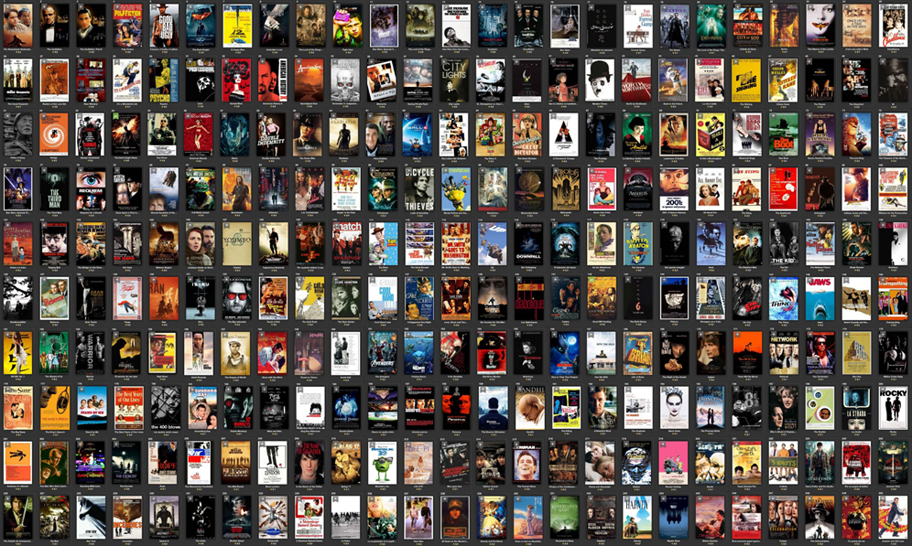

# Investigation of TMDb Movie Dataset
Exploratory data analysis to start digging in to those questions, with data on the plot, cast, crew, budget, and revenues of several thousand films.

## Introducion  -
> #### The primary goal of the project is to go through the general data analysis process — using basic data analysis technique with NumPy, pandas, and Matplotlib. It contains four parts:
* What are some good questions to ask looking at a dataset?
* Data Wrangling
* Exploratory Data Analysis
* Collaborate, visualise, communicate and conclude.

### Packages used - 
*Multiple packages were used* in the notenook. These packages were imported into python 3 version. The packages are:
* Numpy
* Pandas
* Seaborn
* Matplotlib

The first two packages are for combutation and data analysis, and the other two package are for data visulaization. However, Machine learning is covered in other notebook.

## Data Visualization
We now have a basic idea about the data. We need to extend that with some visualizations.
We are going to look at two types of plots:

- ***Univariate plots*** to better understand each attribute, without dealing with causes or relationship.
    * 1-D scatter plot
        - In this plot, we are taking either x or y coordinate of a feature of plotting point and making the other coordinate as zero
    * Histogram
        - Distribution plots(Histogram) are used to visually assess how the data points are distributed with respect to its frequency.
        - Usually the data points are grouped into bins and the height of the bars representing each group increases with increase in the number of data points lie within that group. (histogram).
        - Probability Density Function (PDF) is the probability that the variable takes a value x. (smoothed version of the histogram).
        - Kernel Density Estimate (KDE) is the way to estimate the PDF. The area under the KDE curve is 1.  
            *Here the height of the bar denotes the percentage of data points under the corresponding group*
   
    *  Probability Density Function(PDF) and Cumulative Distribution Function (CDF)
        - Probability Densitiy Function (**PDF**) - It shows the probability of a data point lie under the curve.  
        - Cumulative Distribution Function(**CDF**) - The percent of the data points lies under a limit.
    * Box plot
        - A boxplot is a standardized way of displaying the distribution of data based on a five number summary (“minimum”, first quartile (Q1), median, third quartile (Q3), and “maximum”). It can tell you about your outliers and what their values are. It can also tell you if your data is symmetrical, how tightly your data is grouped, and if and how your data is skewed.

    * Violin plot
        * The violin plot is used to visualise the distribution of the data and its probability density. The thick black bar in the center represents the interquartile range, the thin black line extended from it represents the 95% confidence intervals, and the white dot is the median.

    * Swarm plot
        * A swarm plot can be drawn on its own, but it is also a good complement to a box or violin plot in cases where you want to show all observations along with some representation of the underlying distribution.
 
     
- ***Multivariate plots*** to better understand the relationships between attributes.
    * Scatter plot
        * A scatter plot is a two-dimensional data visualization that uses dots to represent the values obtained for two different variables - one plotted along the x-axis and the other plotted along the y-axis.
    * Pair plot
        * Pair plot is used to understand the best set of features to explain a relationship between two variables or to form the most separated clusters.
        * It reduces higher dimensions(variables) into a matrix of 2D plots.
        * However, pair plot are fairly to be understand if the variable are less(4c2 = 6). If the variable are more than 6(6c2 = 15), deriving insights Pair plots will become a complex part

## Conclusion

### For a successful movie
 - Average Budget must be around 63 millon dollar
 - Average duration of the movie must be 114 minutes
 - Any one of these should be in the cast : Samuel Jackson, Robert De Neiro, Morgan Freeman, Bruce Willis
 - Genre must be : Action, Adventure, Thriller, Comedy, Drama.
 - By doing all this the movie might be one of the hits and hence can earn an average revenue of around 262 million dollar.
 - Movies with higher revenue level are with higher popularity in recent five years.
 - Higher revenue movies don't have significant high score ratinig